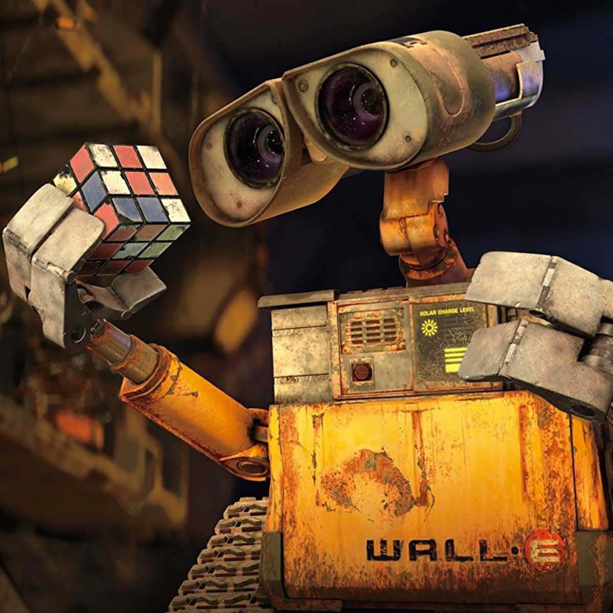

<!-- PROJECT LOGO -->
<br />
<p align="center">
  <a href="https://github.com/wasabiegg/AI_AIMBOT">
    
  </a>

  <h3 align="center">AI_AIMBOT</h3>

  <p align="center">
    <br />
    <a href="https://github.com/wasabiegg/AI_AIMBOT/issues">Report Bug</a>
    ·
    <a href="https://github.com/wasabiegg/AI_AIMBOT/issues">Request Feature</a>
  </p>
</p>


<!-- TABLE OF CONTENTS -->
<details open="open">
  <summary>Table of Contents</summary>
  <ol>
    <li>
      <a href="#about-the-project">About The Project</a>
    </li>
    <li>
      <a href="#getting-started">Getting Started</a>
      <ul>
        <li><a href="#prerequisites">Prerequisites</a></li>
        <li><a href="#installation">Installation</a></li>
      </ul>
    </li>
    <li><a href="#usage">Usage</a></li>
    <li><a href="#roadmap">Roadmap</a></li>
    <li><a href="#contributing">Contributing</a></li>
    <li><a href="#license">License</a></li>
    <li><a href="#contact">Contact</a></li>
    <li><a href="#acknowledgements">Acknowledgements</a></li>
  </ol>
</details>


## DEMO
[![Demo][product-screenshot]](https://github.com/wasabiegg/AI_AIMBOT)


## About The Project
> AI_AIMBOT is an aimbot powered by real-time object detection with neural networks

> Detection model is built on YOLOv5

> Optimized for CS:GO, may work with other FPS game [ you can train your own model ]


<!-- GETTING STARTED -->
## Getting Started

**For education puerposes only, you may get banned from using this in matched games.**

### Prerequisites

* Nvidia card with cuda support
* Only windows supported 
* python>=3.8


### Installation
1. clone repo
  ```sh
  git clone https://github.com/wasabiegg/AI_AIMBOT
  ```
2. Install Nvdia CUDA toolkit
3. Install Nvdia cudnn
4. Install package dependencies
   ```sh
   cd AI_AIMBOT
   pip install -r requirements.txt
   ```


<!-- USAGE EXAMPLES -->
## Usage
1. Tweak settings in config.yaml
2. `python hms.py`
3. You can turn off auto aim at runtime by turning on capslock


<!-- ROADMAP -->
## Roadmap
- [ ] More efficient screen capture
- [ ] Better strategy for target selection
- [ ] Better strategy for target selection

See the [open issues](https://github.com/wasabiegg/AI_AIMBOT/issues) for a list of proposed features (and known issues).


<!-- CONTRIBUTING -->
## Contributing

Contributions are what make the open source community such an amazing place to learn, inspire, and create. Any contributions you make are **greatly appreciated**.

1. Fork the Project
2. Create your Feature Branch (`git checkout -b feature/AmazingFeature`)
3. Commit your Changes (`git commit -m 'Add some AmazingFeature'`)
4. Push to the Branch (`git push origin feature/AmazingFeature`)
5. Open a Pull Request


<!-- LICENSE -->
## License

Distributed under the MIT License. See `LICENSE` for more information.


<!-- CONTACT -->
## Contact

Project Link: [https://github.com/wasabiegg/AI_AIMBOT](https://github.com/wasabiegg/AI_AIMBOT)


<!-- ACKNOWLEDGEMENTS -->
## Acknowledgements
* [Pine](https://github.com/petercunha/Pine)
* [yolov5](https://github.com/ultralytics/yolov5)
* [pytorch](https://github.com/pytorch/pytorch)


[product-screenshot]: demo/demo.gif
